# Exercise 1 - Generating a Fiori elements app

In this exercise, we will create an SAP Fiori elements application based on the given CAP service.
For this we will make usage of the SAP Fiori Tools Application Generator.\
We will consume our local CAP service and use the List Report Object Page floorplan.

## Exercise 1.1 Using the UI Generator

(1) In SAP Business Application Studio, invoke the Command Palette 
(View -\>Command Palette or ctrl+shift+p) and choose
 .

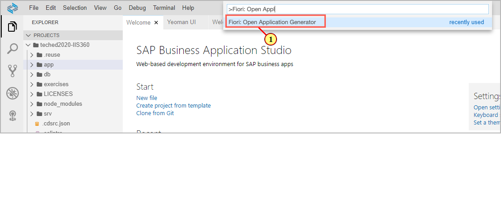

(2) Click on tile **SAP Fiori elements application**.\
(3) Click .

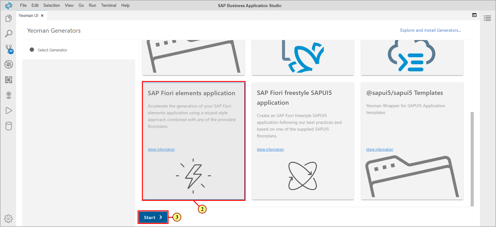

(4) In the template selection, click on tile  **List Report Object Page**.

(5) Click .

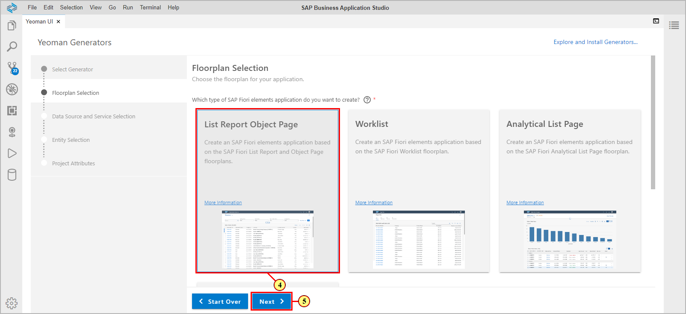

(6) In step **Datasource and Service Selection**, select .

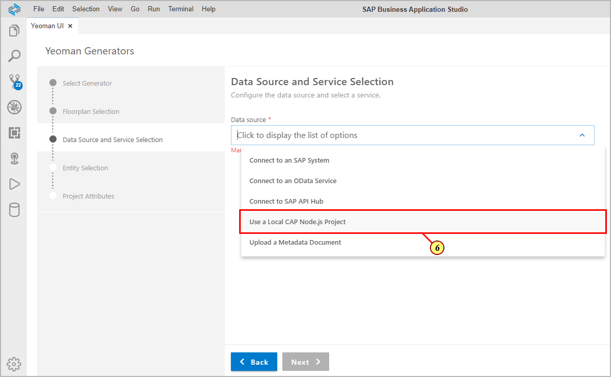

(7) Click the **Browse for folder** icon to select your CAP project folder.

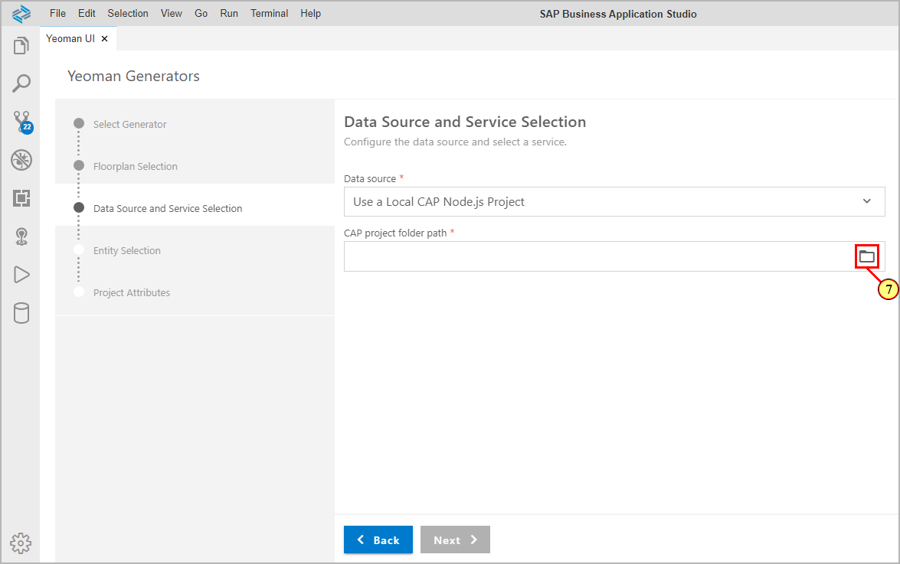

(8) Open the folder hierarchy path **home-\>user-\>projects**.

Click .

(9) Click .

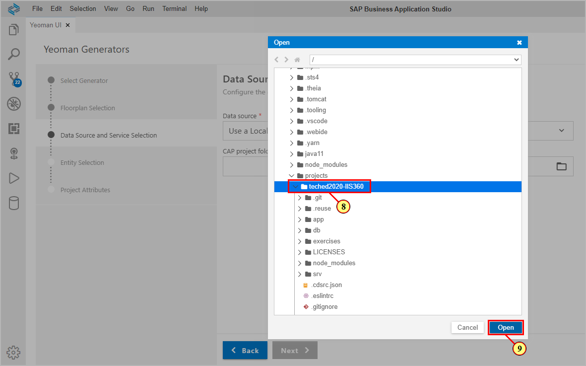

(10) In the OData service drop down, select 

(11) Click .

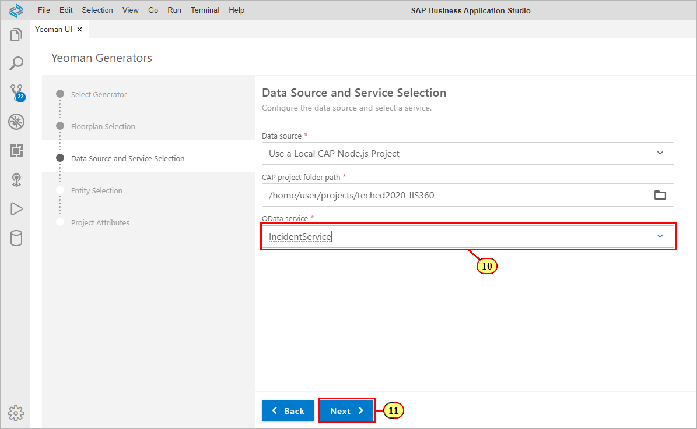

(12) In the Entity Selection drop down, select **Incidents** as main entity.\
The properties of this entity will be used for display of data on List
Report, showing data from the entity collection.\
Leave value for drop down **Navigation Entity** to **none** since we want to show
data of a single instance of the main entity on the object page, too.

(13) Click .

(14) Enter as module name **incidents** (module name has to match exactly for
some of the subsequent exercises to work properly)

(15) Choose an App Title, for example **My Incidents**

(16) Enter as namespace **sap.fe.demo** (namespace has to match exactly for
some of the subsequent exercises to work properly)

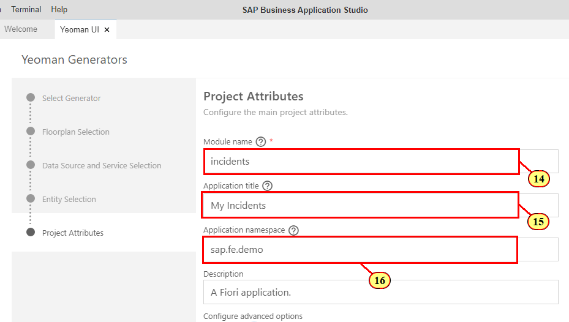

(17) Select **Yes** in order to configure advanced options.

(18) Select **Yes** in order to skip generation of an
additional associated annotation.cds file.\
The CAP service already provides a basic set of UI annotations in a
corresponding file in app-\>annotation.cds.

(19) Click .\

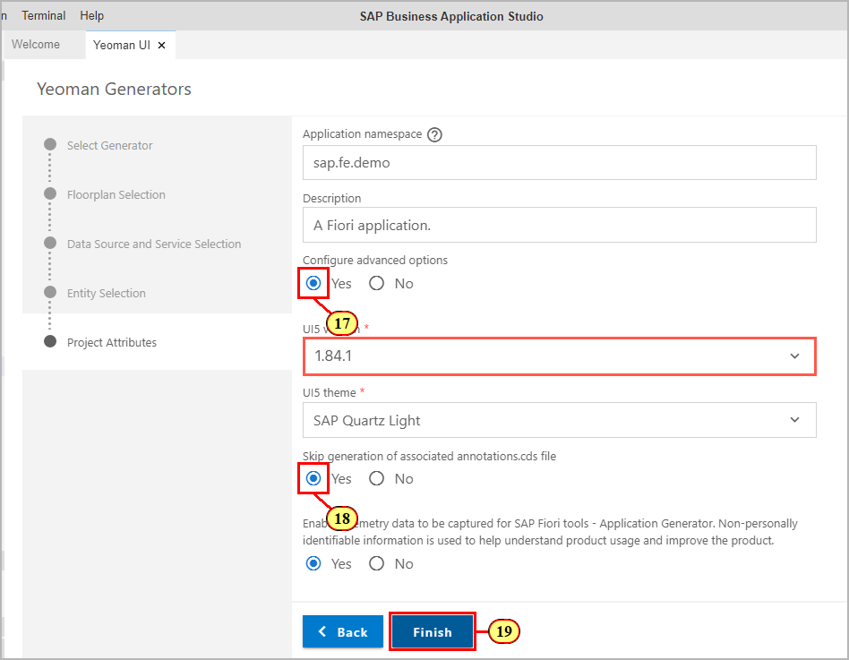

This will start the app generation. When done, you can review the generated artifacts in the Explorer View of SAP Business Application Studio.

## Exercise 1.2 Starting the App

After completing these steps you will have started and tested the generated app.

(20) Switch to the service preview browser tab and refresh it.\
Click on the served path.\
If your preview browser tab had been closed, you can relaunch it by following the steps 'Reopen the exposed ports' as described [here](../ex0#reopen-the-exposed-port).\

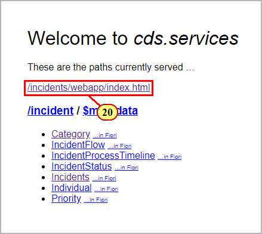

(21) Click on app tile **My Incidents .**

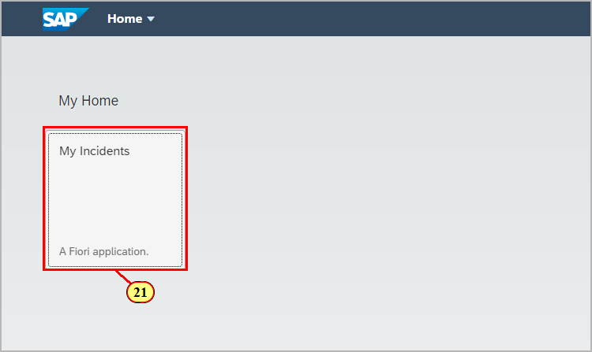

(22) Click  to trigger selection.\
You can use the selection fields in order to set a filter.\

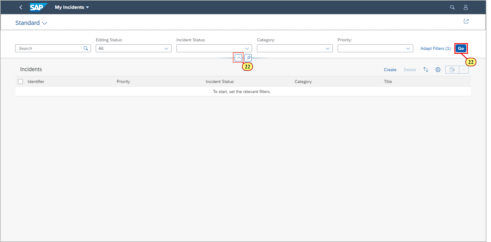

(23) Click on a list item to navigate to the object page.

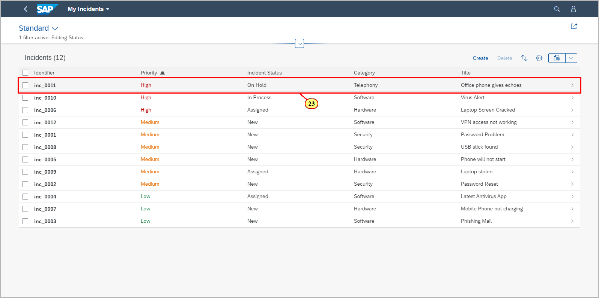

On the object page, you can click **Edit** which creates an edit draft and sets the UI to edit mode.\
Changing input field values will automatically update the draft when input field focus is changed, or when you navigate back to the list report.\
While in edit mode, the List Report shows a draft indicator in the corresponding line item.
The draft is saved back to the active instance by pressing **Save** on the bottom of the object page.\
You can create a new draft on the List Report by clicking button **Create**.

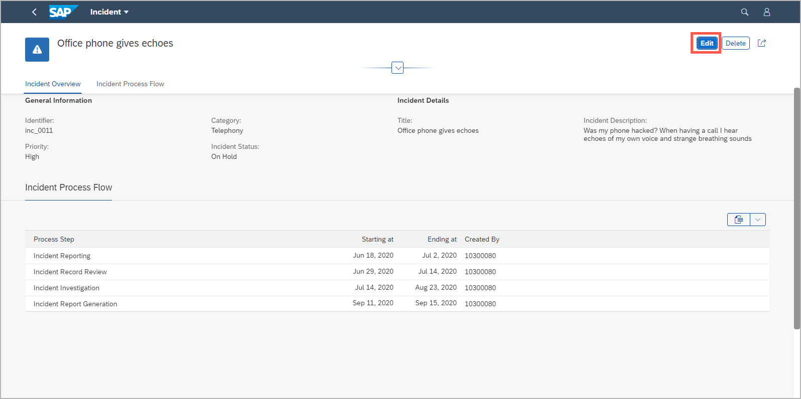

## Summary

You've now successfully generated and tested the Fiori elements app.

Continue to - [Exercise 2 - Extending the app with the Page Map](../ex2/README.md)

