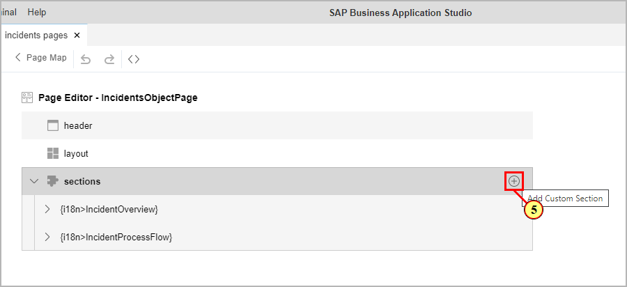
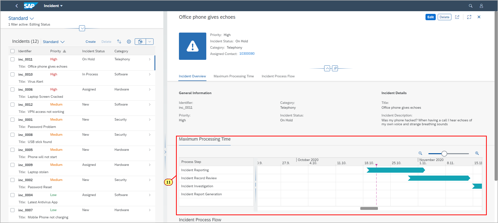

# Exercise 5 - Adding a Custom Section

In this exercise, we will add a custom section to the object page by using the SAP Fiori Page Map.

## Exercise 5.1 Custom Sections Overview

Custom sections offer the possibility of enhancing the object page with a freestyle UI5 XML fragment.<br>
The object page provides its current model context to the custom section, allowing displaying data from the UI5 OData model via context binding.<br>
An additional JS event handler can handle user input.

## Exercise 5.1.1 Enhancing the language model

For the title of custom sections to be shown on the object page, we want to use a property from the apps language model.<br>
(1) Open file **app/incidents/webapp/i18n/i18n.properties**<br>
(2) Enter the following new property:

```json
#XFLD
MaxProcessingTime=Maximum Processing Time
```


Save changes (**File->Save**).

## Exercise 5.1.2 Add custom section via Page Map

The sample scenario provides a prepared XML fragment in folder **app/incidents/webapp/ext/fragment** (3) showing a Gantt chart which you will now add to a new custom section shown on the object page.<br>

In the SAP Business Application Studio, open the page map (via Context Menu on folder **app** or via **View -> Command Palette...**)<br>
(4) On the page map tile **Object Page**, click icon  (**Configure Page**.).


(5) In the Page Editor,  hover in the top right corner of **sections** and click icon (**Add Custom Section**)



(6) In dialog **Add Custom Section**, enter the language property added in step 5.1.1 as a title.

```json
{i18n>MaxProcessingTime}
```

(7) Click radio button **Use Existing Fragment**

.

(8) Open drop down **Target Facet/Section** and select **IncidentOverViewFacet**.<br>
In combination with the **Section Position** (we leave it to **After**), you define where the custom section should be located<br>
on the object page.


(9) Click button 


(10) The page editor now shows an additional section.


(11) Switch to the preview browser tab and refresh. The custom section is shown.



## Summary

You've now ...

Continue to - [Exercise 6 - Adding Annotations ](../ex3/README.md)
