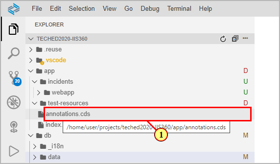
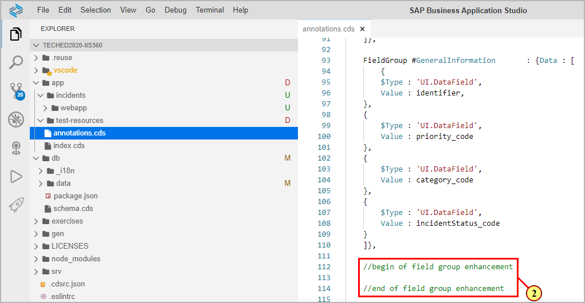
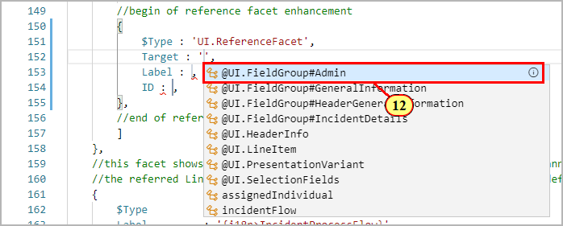
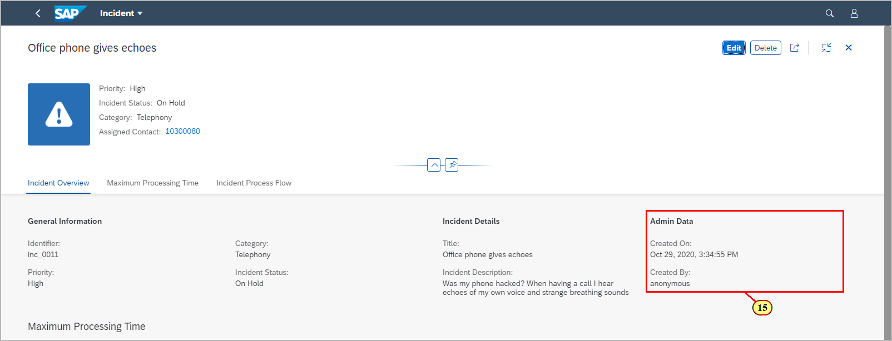

# Exercise 6 - Enhance the UI with annotations

In this exercise, we will enhance the UI by adding annotations. For each exercise, you will make usage of the CDS compilers
LSP support for annotation modelling. Alternatively, you can apply prepared code snippets.
After applying new annotations, you can use Format Document (Shift+Alt+F) to format code for better readibility.

## Exercise 6.1 Sub Exercise 1 Adding a field group

After completing these steps you will have added a new content section to the object page, showing a field group.

(1) In BAS Explorer, open file **app/annotations.cds**.



(2) Place cursor in section **'field group enhancement'**



Trigger the LSP support for annotation modelling by pressing keys **ctrl+space**.<br>
(3) In the popup menu, select **FieldGroup**.


The annotation is added along with its basic structural elements.<br> 
The cursor is placed between 'Fieldgroup' and ':' .<br>
Here you add a qualifier for the annotation which you later can refer to.<br>
(4)Type **#Admin** as qualifier. 


Press tab to move cursor inside the curly brackets.<br>
Trigger LSP support (ctrl+space).<br>
(5)  Select **Property "Data"**.<br> 


The cursor is moved inside the collection [].<br>
Trigger LSP support (ctrl+ space).<br>
(6) Type in **da** to filter the list. Select **Record "DataField"**.


DataField record is added along with its required value, the cursor is placed inside the record {}.<br>
Trigger LSP support.<br>
Type in **cr** to filer the list.<br> 
(7) Select property .


(8) Place the cursor after the record {}, and add additional DataField record with Value **'createdBy'** in the same way


## Exercise 6.2 Add a reference facet

The object pages content area is defined via so called reference facet.<br>
You will now add the field group **#Admin** you just created by referring to in a new reference facet.

(9) Place cursor in section **'reference facet enhancement'**


(10) Select** **.


(11) For property \'Target\', inside quotes \' \', trigger LSP support
with crtl+space.


(12) Select** **.



Press \*\*Tab\*\* key to move cursor to the Label property.<br>
(13) Type **'{i18n\>AdminData}'**.


Press **Tab** key to move cursor to ID property.<br>
(14) Type \*\*\'AdminDataFacet\'\*\* in quotes. Save changes.


(15) New section \'Admin Data\' is shown.



(16) Place cursor below comment \'//begin of column enhancement\'


Trigger LSP support (**Ctrl+Space**).\
(17)  Choose .


Trigger LSP at property **Value :**.<br>
(18)Choose.


Add an empty line after **Value : stepStatus**<br>
Trigger LSP support\
(19)Choose .


Trigger LSP support.<br>
(20) Choose entity property **'criticality'**.<br>


Save changes.
The full annotation now looks the following:


Switch to the preview browser tab and refresh.<br>
(21) On the object page, A new column **Process Step Status** is shown
in table **Incident Process Flow**


## Exercise 2.2 Sub Exercise 2 Description

After completing these steps you will have...

1.	Enter this code.
```abap
DATA(lt_params) = request->get_form_fields(  ).
READ TABLE lt_params REFERENCE INTO DATA(lr_params) WITH KEY name = 'cmd'.
  IF sy-subrc = 0.
    response->set_status( i_code = 200
                     i_reason = 'Everything is fine').
    RETURN.
  ENDIF.

```

2.	Click here.
<br>

## Summary

You've now ...

Continue to - [Exercise 3 - Excercise 3 ](../ex3/README.md)
