# Exercise 7 - Adding a Contact Card Showing Data from SAP S/4 HANA

In this exercise, you extend the sample service with the consumption of an external Business Partner service.<br>
First, you will work with local mock data and later on get the data directly from the external SAP S/4HANA cloud system.<br>
The data will be visualized in the object pages header as a contact card.

## Exercise 7.1 Get the Business Partner EDMX File

You will now download the Business Partner EDMX specification from SAP API Hub and import it into the sample service.\
Open the [SAP API Business Hub page](https://api.sap.com/api/API_BUSINESS_PARTNER/resource?tag=Business%20Partner) in your browser.

(1) Choose the **Details** tab\
(2) Click button **Download API Specification** and select 

If required, log on.
In case you don't have credentials, or have problems downloading the file, you can also find the file API_BUSINESS_PARTNER.edmx within project folder app/test-resources/api-hub.\
If you’re using Chrome as a browser, you now see the downloaded file in the footer bar.

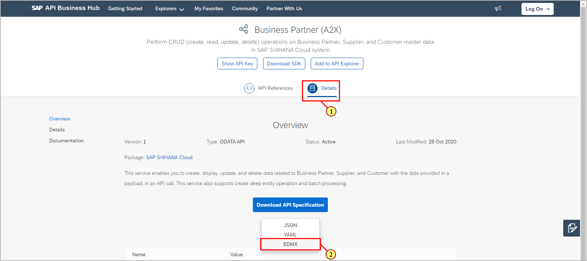

## Exercise 7.2 Adding the EDMX File and Local Data to your Project

In this exercise, you will import the downloaded EDMX specification into the sample service.
By providing mock data, you will be able to develop and test the imported entities without the need of having S/4 HANA backend connectivity in place.

If not already running, start the OData service in a terminal session with **cds watch**.\
Drag the API_BUSINESS_PARTNER.edmx file from your browser's download area/folder over to your SAP Business Application Studio explorer pane and drop it into folder **srv**.


The application programming model will automatically create a new folder  **srv/external** and generate a new file API_BUSINESS_PARTNER.csn in it, which is a compact representation of CDS.\
If the folder is not automatically generated, run the following command in your terminal session from the projects root folder:\
**cds import srv/API_BUSINESS_PARTNER.edmx**

In the SAP Business Application Studio explorer pane, open file **srv/incidentservice.cds**.\
(3) Add the following code in section **begin add using statement** at the beginning of the file:

```js
using {API_BUSINESS_PARTNER as external} from '../srv/external/API_BUSINESS_PARTNER.csn';
```

In the same file, scroll down to section **expose additional entities**.\
(4) Enter the following code below:

```js
@readonly
entity BusinessPartner         as projection on external.A_BusinessPartner {
    key BusinessPartner, BusinessPartnerFullName
};
@readonly
entity BusinessPartnerAddress  as projection on external.A_BusinessPartnerAddress {
    key BusinessPartner, key AddressID, CityName, Country, PostalCode, StreetName, HouseNumber
};
```

By adding the **using** statement (3), a new service is exposed with a definition based on the original edmx file.\
Furthermore, you have extended the Incidents service by adding two projected entities from the Business Partner API (4).

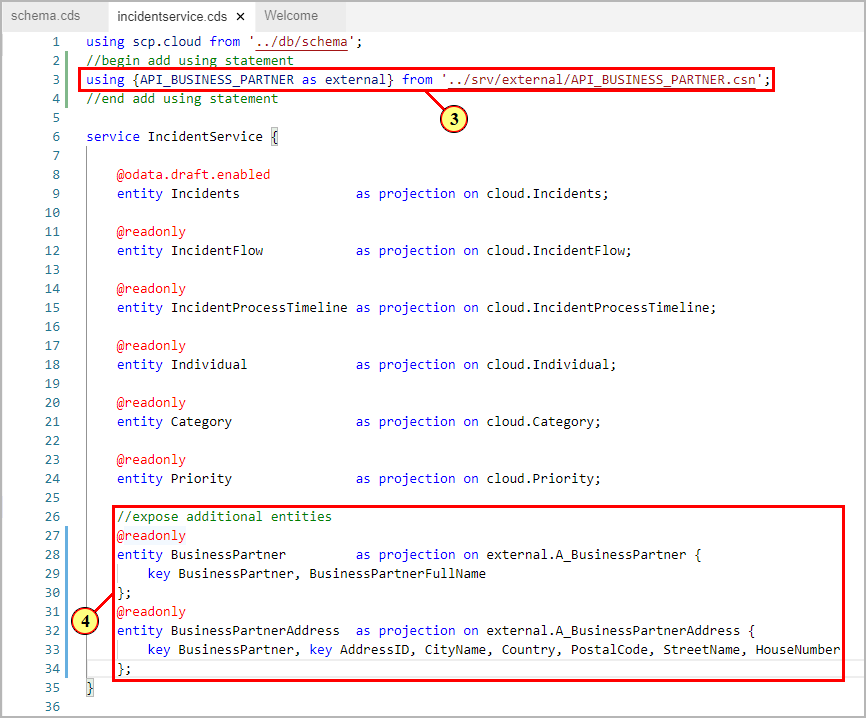

Since there is no backend connectivity in place yet, you will start with using local data first.\
In SAP Business Application Studio explorer pane, open folder\
**app/test-resources/api-hub/data**.

(5) Select the following two CSV files, drag and drop them to folder **db/data**.

- API_BUSINESS_PARTNER-A_BusinessPartner.csv
- API_BUSINESS_PARTNER-A_BusinessPartnerAddress.csv

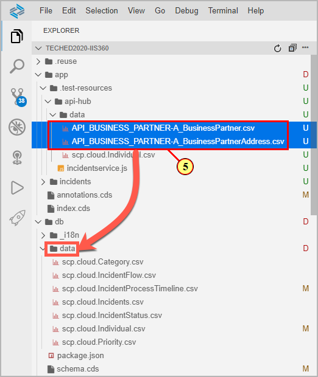

(6) In the preview browser tab, click on one of the marked entities to show mock data.\
Note that only the fields show data where mock data has been provided for.

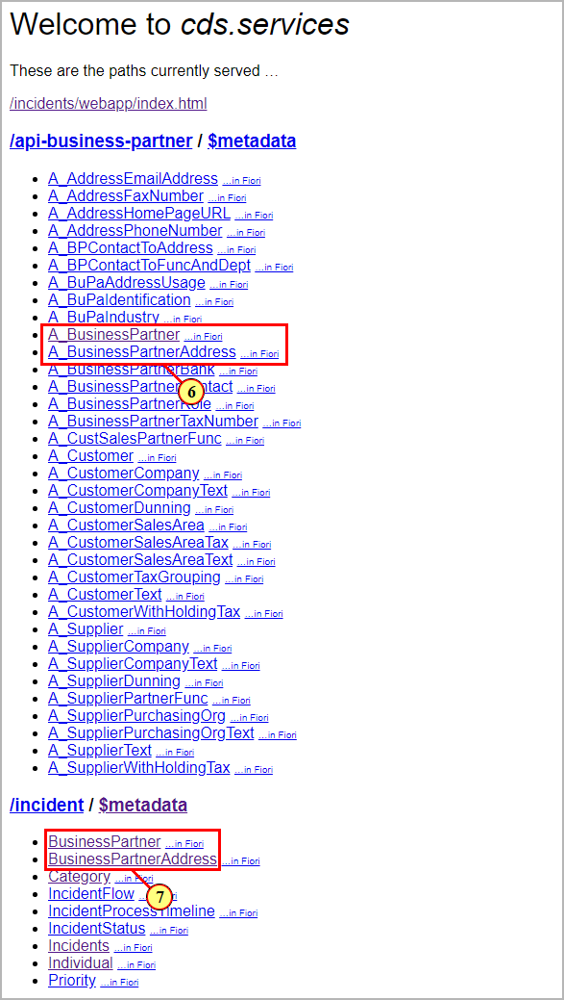

(7) Clicking on the new entities of the Incidents service shows mock
data for the projected entity fields only.

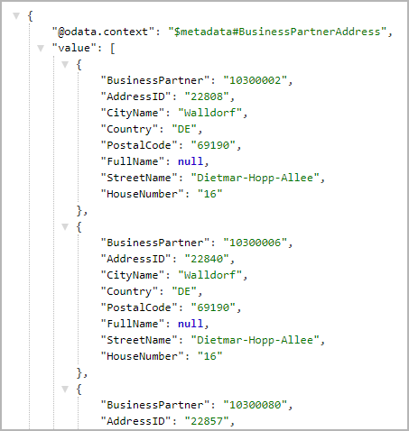

## Exercise 7.3 Adding Associations to the Incidents Service Entities

In this exercise, you will add additional properties to entity **Individual** and associations to the Business Partner Service entities.

In the SAP Business Application Studio explorer pane, open file **db/schema.cds**.\
(8) Scroll to section **Begin add additional properties** in entity **Individual** and add these two additional properties:

```js
businessPartnerID : String;
addressID : String;
```

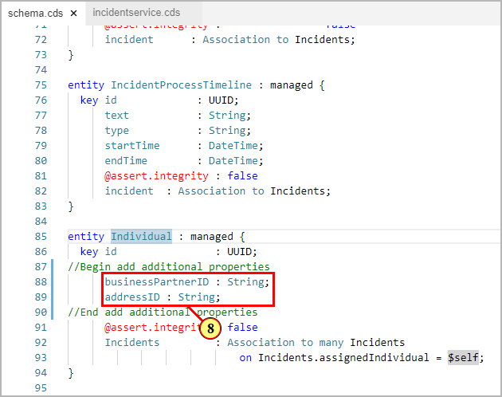

For the additional properties, mock data is required.\
In SAP Business Application Studio explorer pane, open folder **app/test-resources/api-hub/data**.\
(9) Select the remaining CSV file scp.cloud.Individual.csv.\
(10) Drag and drop to folder **db/data**.

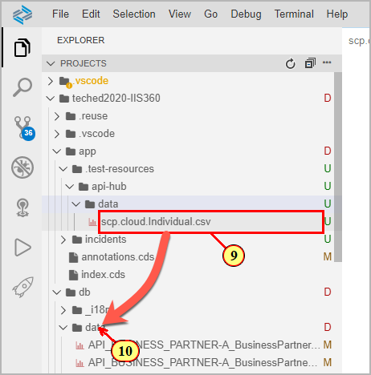

(11) Click  to confirm replacement of the existing csv file.


(12) In your browser preview tab, select entity .

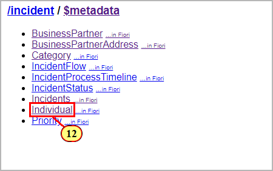

(13) Mock data for the additional properties are shown.

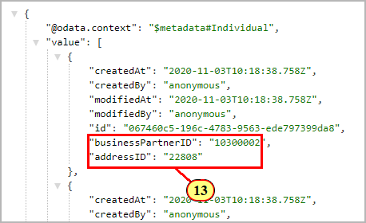

In order to incorporate the external services data into the service model, you will now add some associations.\
In SAP Business Application Studio explorer pane, open file **db/schema.cds**.\
(14) Add the following code in section **begin add using statement** at the beginning of the file:

```js
using {API_BUSINESS_PARTNER as external} from '../srv/external/API_BUSINESS_PARTNER.csn';
```


Scroll down to section **add associations to external entities** at the end of the file.\
(15) Add the following code:

```js
extend scp.cloud.Individual with {
  businessPartner        : Association to one external.A_BusinessPartner
  on businessPartner.BusinessPartner = businessPartnerID;
  businessPartnerAddress : Association to one external.A_BusinessPartnerAddress
  on  businessPartnerAddress.BusinessPartner = businessPartnerID
  and businessPartnerAddress.AddressID       = addressID;
    }
```

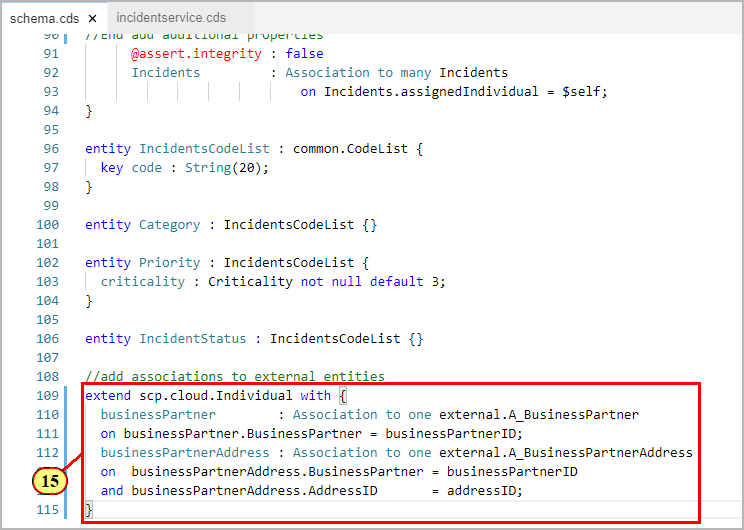

Note that the mock data that was added in step (11) for entity scp.cloud.Individual properties **businessPartnerID** and **addressID**\
need to match existing business partner address data keys in your SAP S/4 HANA cloud system when later switching\
from mock data to real SAP S/4 HANA Cloud connectivity.

You can test the new associations in the preview browser tab.
Select service entity **Individual** and add the following to the browser Url

```js
(id=067460c5-196c-4783-9563-ede797399da8)?$expand=businessPartnerAddress
```

This will show the business partner address data inline with the Individual data.


## Exercise 7.4 Adding an Annotation for a Contact Card

In this exercise you will add an annotation of type **@Communication.Contact** with properties referring to the\
new external entities, and enhance the object page header to show a contact card link.

In SAP Business Application Studio explorer pane, open file **srv/common.cds**.\
(16) Add the following code to section **add contact card annotation** at the end of the file:

```js
annotate service.Individual with @(Communication.Contact : {
      fn   : businessPartner.BusinessPartnerFullName,
        adr   : [{
            type     : #work,
            code     : businessPartnerAddress.PostalCode,
            street   : businessPartnerAddress.StreetName,
            building : businessPartnerAddress.HouseNumber,
            country  : businessPartnerAddress.Country,
            locality : businessPartnerAddress.CityName
        }]
});
```

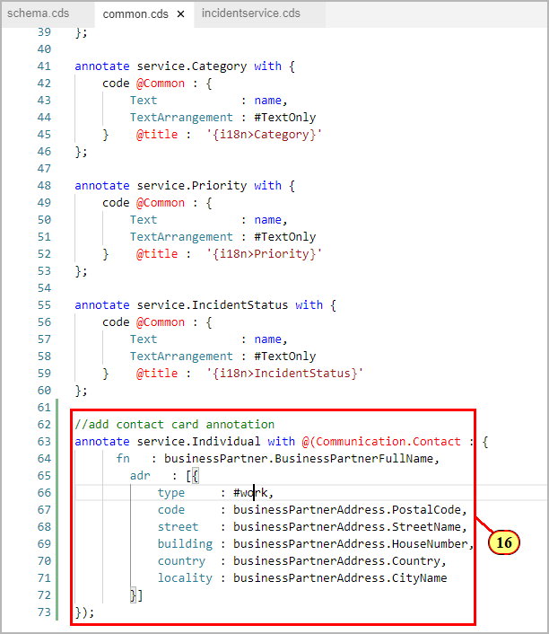

To visualize the contact card in the object pages header, you need to add an additional annotation.\
Open file **app/annotation.cds** and locate section **begin of header facet enhancement**.\
(17) Enter the following code:

```js
    {
        $Type : 'UI.ReferenceFacet',
        Label : '{i18n>AssignedContact}',
        Target : 'assignedIndividual/@Communication.Contact',
    }
```


(18) Go to the preview browser tab and refresh.

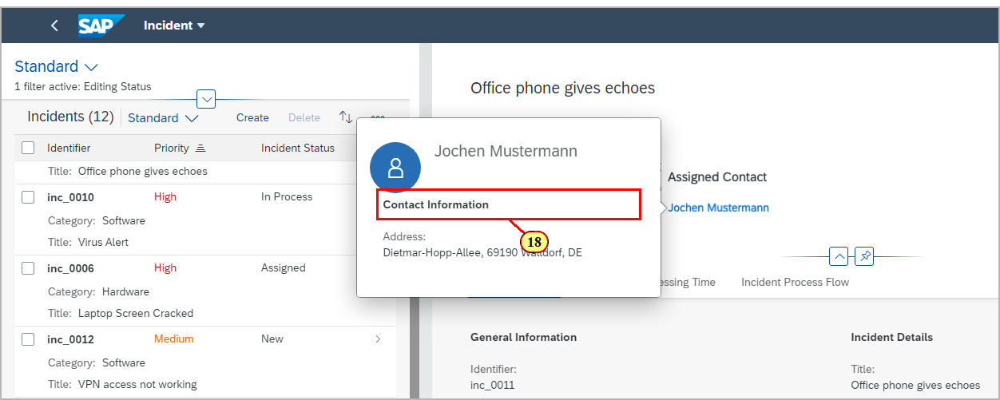

By enhancing the header facet with an annotation of type **reference facet** targeting the **@Communication.Contact** annotation,\
the object page header now shows a contact card link.

## Exercise 7.5 Fetching Business Partner Data from an SAP S/4 HANA Cloud system

### Prerequisites

In order to consume business partner data from an S/4 HANA Cloud system, inbound communication to an SAP S/4 HANA tenant needs to be in place.\
An example for the necessary implementation steps (create communication system and communication arrangement) is described [here](https://help.sap.com/viewer/b0e8d558ba2f47f5b02a3fc0ac9edc34/SHIP/en-US/70fb7224a6df4e099ff264081667a0fc.html).\
The SAP S/4 HANA API **technical user credentials for inbound communication** (generated with the setup of the communication system\
in SAP S/4 HANA Cloud) need to be added to file **default-env.json**, located in the root folder of the sample project.\
Furthermore, the Business Partner OData API URL for the specific SAP S/4 HANA cloud instance needs to be completed.\
The relevant fields are highlighted in the screenshot below.

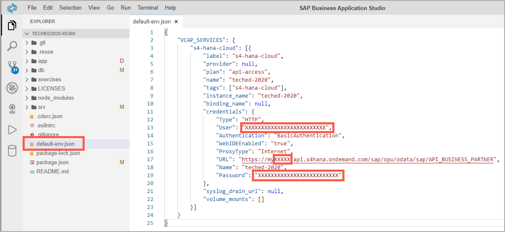

In this exercise, you will add custom handler code which is called on the READ event of the BusinessPartner and BusinessPartnerAddress entities.\
Whenever an OData call for business partner data issued from the UI, this handler is called.\
For further details about the currently supported query capabilities, please refer to chapter **Sending Requests** of the [SAP Cloud Application Programming Model documentation](https://cap.cloud.sap/docs/guides/consuming-services#sending-requests).

In SAP Business Application Studio explorer pane, open folder **app/test-resources/api-hub**.\
(19) Drag file .\
(20) Drop on folder **srv**.


(21) Click  to confirm that the existing file is overwritten.


In the explorer pane, open file package.json in the root folder and scroll down to section **"cds"**.\
(22) Remove hyphens from properties **model** and **credentials** to enable the external service configuration.\
More details abound external services configuration can be found [here](https://cap.cloud.sap/docs/guides/services#rest-and-odata).


(23) On your preview browser tab, select entity **BusinessPartnerAddress.**

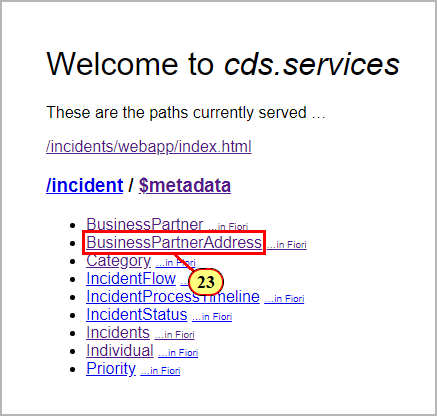

The OData response will now show data retrieved from the S/4 HANA system.

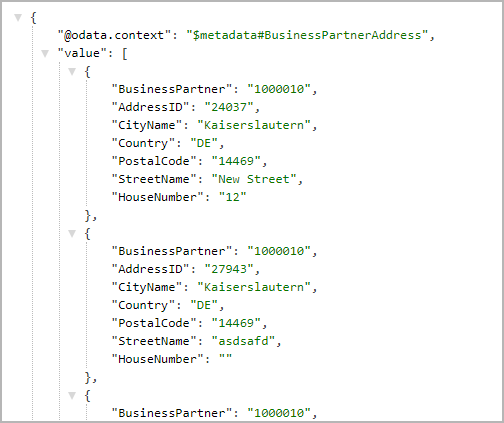

(24) In your preview browser, open the app and navigate to the object page.\
The contact card now shows data from S/4 HANA.

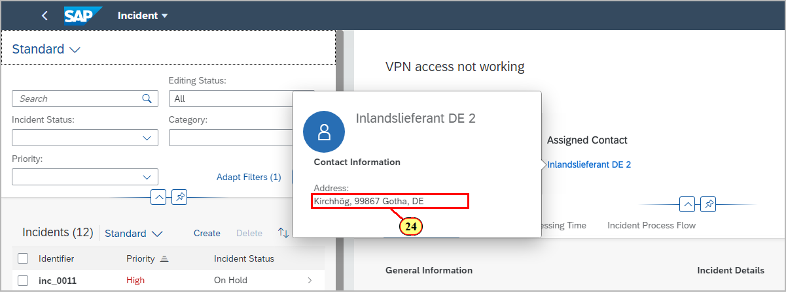

## Summary

You've now successfully completed the hands-on workshop. Congratulations!
